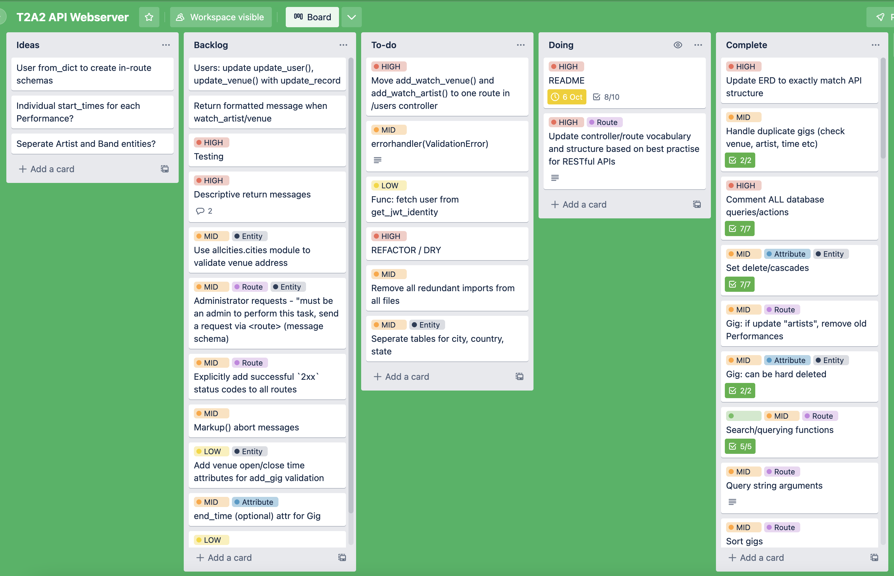

# **T2A2 Web API assessment** - *Tané Kaio*

***
### **Identify problem to be solved**
***

As a passionate music lover who doesn't use social media platforms like Facebook or Instagram, it has become increasingly difficult to keep up to date and know what's happening in my local music scene. But even when I used those platforms, the smaller "word-of-mouth" shows (that usually produce the most magical moments) would often be obscured or not posted at all. Facebook in particular typically relies on the musical act, the venue and/or an events/ticketing company to publish a show - I would like to propose a platform for the *punters* to share upcoming shows with each other with a focus on community spirit - the heart of music. 

***
### **Why is it a problem that needs solving?**
***

For a long time social media platforms such as Facebook and Instagram have dominated the “events” category for local music scenes. But people are increasingly withdrawing from social media for various reasons, which can make staying in the loop difficult in a digital world. Bands still need exposure and people still need to know where they can get their music fix, so a public and free local gig database can solve these problems in an environment that doesn’t have some of the less desirable side effects of social media. 

***
### **Why have I chosen PSQL? Pros/cons, compare to others**
***

I have chosen PostgreSQL (PSQL) as my *database management system* (DBMS) because it as well as being the focal database system used in class, it is free, open-source and offers all the features I need for this API project. Another option would have been MySQL, which is also open source and potentially offers faster performances and is easier to use, however PSQL supports more advanced features, such as the `CASCADE` deletion event constraints, the `EXCEPT` query clause to exclude results from a search and the ability to store complex data objects such as arrays. MySQL, however does outperform PSQL for read-only processes however given the scope of my project it shouldn't be too significant of a factor. 

https://www.postgresqltutorial.com/postgresql-tutorial/postgresql-vs-mysql/ 

***
### **Identify and discuss the key functionalities and benefits of an ORM**
***

I will be utilising a database toolkit called *SQLAlchemy* as my Object Relational Mapper (ORM) for the API. An ORM essentially allows a translation between SQL commands and statements (such as `SELECT * FROM table`) from an object oriented environment - such as an application written in Python. This allows us to interact with and control our PostgreSQL database (which is natively controlled by pure SQL syntax) from our Flask application, opening the door to endless possibilities of database manipulation with programmatic conditions and instructions. ORM's like SQLAlchemy simply map SQL code to our preferred programming language, so that our example above `SELECT * FROM table` can be expressed in our application as `table.query.all()`. 

https://blog.bitsrc.io/what-is-an-orm-and-why-you-should-use-it-b2b6f75f5e2a 

***
### **Detail any third party services that your app will use**
***

* **Flask** (`flask`) is at the spine of the API and is the Python web framework I will be using which is fairly lightweight however it offers great features like a built-in developmental server and easy web app configuration. As it's so barebones there are many great services that are made for it which offers a great deal of flexibility. It does, however provide features such as `Blueprint`, `request`, `abort` and `Markup` that will help with handling web-based features of the API.

* As mentioned above, I will be using **SQLAlchemy** as well as the Flask-specific **Flask-SQLalchemy** (`sqlalchemy` and `flask_sqlalchemy`) as my object-relational-mapper to interact with my database. Flask doesn't have its own database abstraction layer so we need packages like this to streamline database management

* For serialisation/deserialisation I will be implementing **Marshmallow** (`flask_marshmallow`) to convert complex data objects to simple Python datatypes. I will be constructing my schemas using Marshmallow's `Schema` class, which allows me to control validation and handle exceptions using modules from the `marshmallow` package such as `ValidationError`.

* I will be controlling user authentication using **Flask-JWT-Extended** (`flask_jwt_extended`), which is a service that generates and handles JSON Web Token features. I can verify the current user's identity using functions such as `get_jwt_identity()` and use the `@jwt_required()` decorator to control route access. 

* For sensitive data storage I will use **Flask-Bcrypt** (`flask_bcrypt`) for its hashing tools to ensure that sensitive information such as passwords are not stored in plain-text in the database.

***
### **R9. Discuss the database relations to be implemented in your application**
***

The main entities that will be tracked in my database are `User`, `Gig`, `Venue` and `Artist`. So the base tables in the database will be `users`, `gigs`, `venues` and `artists`.

* The `users` table will hold `User` records. A `User` is a representation of an individual using the API. A user's profile that holds their identifying information such as `username`, `first_name`, `last_name`, access privileges such as whether or not they're `loggd_in` or an `admin` (administrator) - as well as their login credentials `email` and `password`. 
* The `gigs` table will hold `Gig` records. A `Gig` is a music event that is posted by a user and holds properties such as the `title` (or name) of the show, a `description`, the `artists` that will be performing, the `start_time` which holds the time and date the the show begins, the `price` of a ticket/admission, a link to purchase tickets `tickets_url`, a timestamp for when the gig was created `date_added`, whether or not it's expired or active `is_expired`, the ID of the `Venue` where the gig is located in `venue_id` and the ID of the `User` that posted it in `user_id`
* The `venues` table will hold `Venue` records. A `Venue` is the physical location where the `Gig` is taking place. It holds its `name`, the `type` of venue (pub, restaurant, concert hall, house etc) and its address details like `street_address`, `city`, `state` and `country`.
* The `artists` table will hold `Artist` records. An `Artist` is the individual musician or band that will play at a `Gig`. Their properties are their `name` and `genre`.

***
### **Describe your projects models in terms of the relationships they have with each other**
***

* A `User` can post many `Gigs`, but a `Gig` can only be posted by one `User` (1-M)
* A `User` can watch many `Venues`, and a `Venue` can be watched by many `Users` (M-M)
* A `User` can watch many `Artists`, and an `Artist` can be watched by many `Users` (M-M)
* A `Venue` can have many `Gigs`, but a `Gig` can only have one `Venue` (1-M)
* A `Gig` can have many `Artists`, and an `Artist` can play at many `Gigs` (M-M)

A `User` posts `Gigs` (1-M), so each `Gig` will inherit a `user_id` as a foreign key. A `User` can also *watch* or *follow* a `Venue` (M-M) which essentially adds the `Venue` to the user's watchlist, so a `WatchVenue` model is the association table that stores that link and inherits the `venue_id` and `user_id` as foreign keys. A `User` can also do the same with an `Artist` (M-M), so a `WatchArtist` association table will store the `user_id` and `artist_id` of the action. A `Gig` can have many `Artists`, and an `Artist` can play many `Gigs` (M-M) so the `Performance` table stores the `gig_id` and `artist_id` of each performance. 

***
### **Describe the way tasks are allocated and tracked in your project**
***

I will be using **Trello**, a web-based project management application as my task manager for the project. 
I will be employing a loose *kanban* framework to my Trello board and distinctly categorising tasks into these columns: `Ideas` are loose ideas that I may come up with that don't have any clear actions yet - `Backlog` are tasks that I would like to achieve but aren't totally necessary right now, `To-do` are tasks flagged as needing to be done in the near future, `Doing` are tasks that I have actually starting and am actively working on and `Completed` are tasks that I have completed. Within each "card" (task) I store checklists if necessary to keep track of each step/mini-task and assign due dates/times if it is time sensitive, as well as labelling each task by their priority level. 

***
### **Document all endpoints for the API**
***

### **Authorisation controller** `/auth`

***Register a new user***

* `[GET] localhost:5000/auth/register` will return an empty `User` object as a JSON array for the user to use to register/create a new `User`

* `[POST] localhost:5000/auth/register` will create a new `User` object to store in the database - the `password` will be hashed upon creation. An JSON web token will be returned to authenticate the user which has an expiry of 24 hours.

***User login/logout***

* `[GET] localhost:5000/auth/login` will return a login form as a JSON array for the user to fill out.
* `[POST] localhost:5000/auth/login` will take that data from the login form and verify if the information is correct. If verified, it will return a JSON web token.
* `[POST] localhost:5000/auth/logout` will log the current user out.

### **User controller** `/users`

***User profiles***

* `[GET] localhost:5000/users/<user_id>` will return the specified user from the URL argument. 
* `[PUT] localhost:5000/users/<field>` will update a user's information via the field as specified from the URL argument
* `[DELETE] localhost:5000/users/<user_id>` will delete a user (provided that they're the owner of the profile or an administrator)
* `[GET] localhost:5000/users/watchlist` will return the current user's watchlist including their watched venues and artists.

### **Gig controller** `/gigs`

