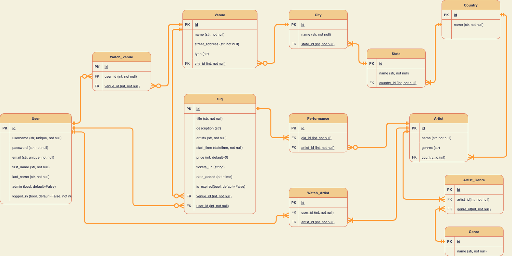
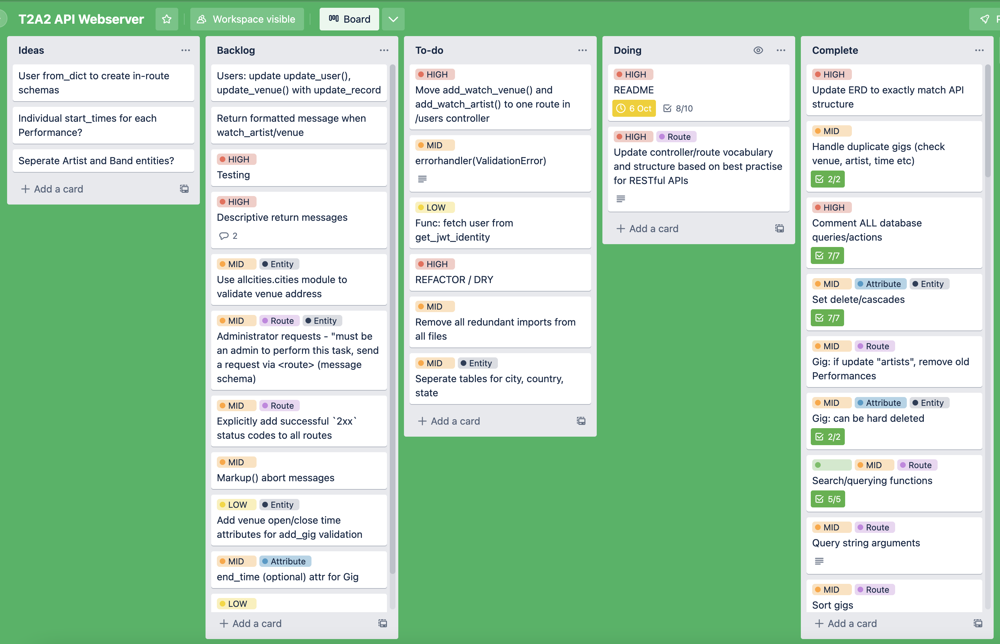

# ***Gig Guide Web API*** 
### T2A2 - *Tané Kaio*
> [Github repository](https://github.com/Lanruoj/Gig-Guide-Webserver-API)
***
### **Identify problem to be solved**
***

As a passionate music lover who doesn't use social media platforms like Facebook or Instagram, it has become increasingly difficult to keep up to date and know what's happening in my local music scene. But even when I used those platforms, the smaller "word-of-mouth" shows (that usually produce the most magical moments) would often be obscured or not posted at all. Facebook in particular typically relies on the musical act, the venue and/or an events/ticketing company to publish a show - I would like to propose a platform for the *punters* to share upcoming shows with each other with a focus on community spirit - the heart of music. 

***
### **Why is it a problem that needs solving?**
***

For a long time social media platforms such as Facebook and Instagram have dominated the “events” category for local music scenes. But people are increasingly withdrawing from social media for various reasons, which can make staying in the loop difficult in a digital world. Bands still need exposure and people still need to know where they can get their music fix, so a public and free local gig database can solve these problems in an environment that doesn’t have some of the less desirable side effects of social media. 

***
### **Why have I chosen PSQL? Pros/cons, compare to others**
***

I have chosen PostgreSQL (PSQL) as my *database management system* (DBMS) because it as well as being the focal database system used in class, it is free, open-source and offers all the features I need for this API project. Another option would have been MySQL, which is also open source and potentially offers faster performances and is easier to use, however PSQL supports more advanced features, such as the `CASCADE` deletion event constraints, the `EXCEPT` query clause to exclude results from a search and the ability to store complex data objects such as arrays. MySQL, however does outperform PSQL for read-only processes however given the scope of my project it shouldn't be too significant of a factor. 

***
### **Identify and discuss the key functionalities and benefits of an ORM**
***

I will be utilising a database toolkit called *SQLAlchemy* as my Object Relational Mapper (ORM) for the API. An ORM essentially allows a translation between SQL commands and statements (such as `SELECT * FROM table`) from an object oriented environment - such as an application written in Python. This allows us to interact with and control our PostgreSQL database (which is natively controlled by pure SQL syntax) from our Flask application, opening the door to endless possibilities of database manipulation with programmatic conditions and instructions. ORM's like SQLAlchemy simply map SQL code to our preferred programming language, so that our example above `SELECT * FROM table` can be expressed in our application as `table.query.all()`. 

### **Endpoints documentation**

### ***Authorisation controller*** `/auth`
***

**Register a new user**

> `[GET] localhost:5000/auth/register`  

* Return an empty `User` form with valid fields for the user to use to register/create a new `User`

*Expected response (`200 OK`):*
```
{
    "email": "[string: must be a valid email address]",
    "username": "[string: alphanumeric + '_']",
    "password": "[string: alphanumeric + '!@#$%^&*()-_+=']",
    "first_name": "[string]",
    "last_name": "[string]"
}
```

> `[POST] localhost:5000/auth/register`  

* Create a new `User` object
    * Checks if the request's `username` or `email` already exists
    * `username` must only contain alphanumeric characters or underscores *(maximum length 32)*
    * `password` must only contain alphanumeric characters + `!@#$%^&*()-_+=` - hashed upon creation *(minimum length 8)*  
    * A JSON web token will be returned to authenticate the user with an expiry of 24 hours

*Example request:*
```
{
    "email": "email@email.com",
    "username": "new_user123",
    "password": "password!123",
    "first_name": "New",
    "last_name": "User"
}
```

*Expected response (`201 CREATED SUCCESS`):*
```
{
    "message": "New successfully created and logged in",
    "user": "new_user123",
    "id": 4,
    "token": "<JWT>"
}
```

**User login**

> `[GET] localhost:5000/auth/login`  

* Return an empty `User` form with fields needed for login

*Expected response (`200 OK`):*
```
{
    "email": "...",
    "password": "..."
}
```

> `[POST] localhost:5000/auth/login`  

* Takes the data from the login form and verify if the information is correct. If verified, it will return a JSON web token with an expiry of 24 hours

*Example request:*
```
    "email": "email@email.com",
    "password": "password!123"
}
```

*Expected response (`200 OK`):*
```
{
    "message": "New successfully logged in",
    "user": "new_user123",
    "id": 4,
    "token": "<JWT>"
}
```

**User logout**

> `[POST] localhost:5000/auth/logout`  

* Logs the current user out (parsed from JWT)

*Expected response (`200 OK`):*
```
{
    "message": "new_user123 successfully logged out"
}
```

***
### ***User controller*** `/users`
***

**User profiles**

> `[GET] localhost:5000/users/account`  

*  Retrieve the current all of the current user's information (parsed from JWT)
    * User must be logged in with valid JWT

*Example response (`200 OK`):*
```
{
    "id": 4,
    "username": "new_user123",
    "email": "email@email.com",
    "first_name": "New",
    "last_name": "User",
    "logged_in": false,
    "watched_venues": [],
    "watched_artists": []
}
```


> `[GET] localhost:5000/users/profiles/search`  

* Search `Users` - by default all non-admin user's profiles, but takes query string arguments for filtering and sorting

*Example request:* `[GET] /users?first_name=User` returns users with the `first_name` of "User")

*Expected response (`200 OK`):*
```
[
    {
        "username": "user",
        "first_name": "User",
        "last_name": "Test",
        "watched_venues": [
            {
                ...
            }
        ],
        "watched_artists": [
            {
                ...
            }
        ]
    },
    {
        "username": "user123",
        "first_name": "User",
        "last_name": "Two",
        "watched_venues": [],
        "watched_artists": []
    }
]
```


> `[GET] localhost:5000/users/<user_id>`  

* *Administrator only* - Return all details about the user specified from the URL argument
    * User must be logged in with valid JWT with administrative privileges

*Example request:* `[GET] /users/5` 

*Expected response (`200 OK`):*
```
{
    "id": 5,
    "username": "user123",
    "email": "user123@email.com",
    "first_name": "User",
    "last_name": "Two",
    "logged_in": true,
    "watched_venues": [],
    "watched_artists": []
}
```

> `[DELETE] localhost:5000/users/<user_id>`  

* *Administrator only* - delete specified user's account
    * User must be logged in with valid JWT with administrative privileges
* Returns `200 OK` and message

> `[GET] localhost:5000/users/profiles`  

*  Get the current user's profile (parsed from JWT)
    * User must be logged in (valid JWT)

*Expected response (`200 OK`):*
```
{
    "username": "user123",
    "first_name": "User",
    "last_name": "Two",
    "watched_venues": [],
    "watched_artists": []
}
```

> `[GET] localhost:5000/users/profiles/<user_id>`  

* Retrieve the specified user's profile from the URL argument

*Example request:* `[GET] /users/profiles/5` 

*Expected response (`200 OK`):*
```
{
    "username": "user123",
    "first_name": "User",
    "last_name": "Two",
    "watched_venues": [],
    "watched_artists": []
}
```

> `[GET] localhost:5000/users/profiles/form`  

* Retrieve the current user's editable profile form to be used to update profile at `[PUT] /users`
    * User must be logged in with valid JWT

*Expected response (`200 OK`):*
```
{
    "username": "user123",
    "email": "user123@email.com",
    "first_name": "User",
    "last_name": "Two"
}
```

> `[PUT] localhost:5000/users/profiles`  

* Update the current user's profile with the request's data
    * User must be logged in with valid JWT
    * Takes `User` array from `[GET] localhost:5000/users/profile/form` as input structure
    * e.g:
        ```
        {
        "username": "exampleuser",
        "email": "example@email.com",
        "first_name": "Example",
        "last_name": "User"
        }

    * If `password` is updated it will be hashed
* Returns `200 OK` and the updated profile and a link to it


> `[DELETE] localhost:5000/users/profiles`  

* Delete current user's profile
    * Must be logged in with valid JWT
* Returns `200 OK` and success message 

**View user's watchlist:**

> `[GET] localhost:5000/users/watchlist`  

* Retrieve the current user's watchlist including their watched venues and artists
    * User must be logged in with valid JWT
* Returns `200 OK` and user's watchlist

> `[GET] localhost:5000/users/watchlist/form`  

* Retrieve an empty `WatchArtist`/`WatchVenue` form to be used to add a new record

*Expected response data* (`200 OK`)
```
{
    "artist_id / venue_id": "[integer]"
}
```

> `[POST] localhost:5000/users/watchlist/` 

* Create new watchlist item for user
    * User must be logged in with valid JWT
    * If request has valid `"venue_id"` it will create a new `WatchVenue` record and user will be watching that venue
    * If request has valid `"artist_id"` it will create a new `WatchArtist` record and user will be watching that artist

*Example request data:*
```
{
    "venue_id": 1
}
```
*Expected response data (`200 OK`):* 
```
{
    "message": "You are now watching The Gasometer Hotel",
    "result": {
        "id": 6,
        "user_id": 1,
        "venue_id": 1
    ...
}
```

> `[DELETE] localhost:5000/users/watchlist/` 

* Removes an `Artist` or `Venue` from a `User`'s watchlist - deletes a `WatchArtist`/`WatchVenue` record
    * User must be logged in with a valid JWT
    * If request has valid `"venue_id"` it will delete the corresponding`WatchVenue` record
    * If request has valid `"artist_id"` it will delete the corresponding `WatchArtist` record

*Example request data:*
```
{
    "venue_id": 1
}
```
*Expected response data (`200 OK`):*
```
{
    "message": "The Gasometer Hotel has been successfully removed from your watchlist"
}
```


***
### ***Gig controller*** `/gigs`
***

*Before each request is processed for all the `/gigs` routes all `Gigs` expiries will be checked and updated.*

> `[GET] localhost:5000/gigs/search`  

* Search gigs - by default all upcoming gigs, but takes query string arguments for filtering and sorting
* For example: `[GET] localhost:5000/gigs?venue_id=2&sort:desc=price` returns gigs with the `venue_id` of `2` and sorts the results by `price` in descending order)

*Expected response data (`200 OK`):*
```
[
    {
        "id": 2,
        "title": "Gig #2",
        "gig_venue": "Venue 2",
        "artists": "Artist 2",
        "description": null,
        "start_time": "2023-01-04T17:00:00",
        "price": 79,
        "tickets_url": null,
        "date_added": "2022-10-08T11:34:21.654677",
        "posted_by": "admin",
        "is_expired": false,
        "venue_id": 2,
        "user_id": 1
    },
    {
        "id": 1,
        "title": "Gig #1",
        "gig_venue": "Venue 2",
        "artists": "Artist 1",
        "description": null,
        "start_time": "2023-05-17T18:00:00",
        "price": 55,
        "tickets_url": "https://tickets.gig.com",
        "date_added": "2022-10-08T09:02:09.606487",
        "posted_by": "CoolGuy",
        "is_expired": false,
        "venue_id": 2,
        "user_id": 3
    }
]
```

> `[GET] localhost:5000/gigs/<gig_id>` 

* Retrieves gig with `id` as specified in URL argument

*Example URL path:*

`/gigs/2`

*Expected response data (`200 OK`):*
```
{
    "id": 2,
    "title": "Gig #2",
    "gig_venue": "Venue #3",
    "artists": "Artist #1",
    "description": "...",
    "start_time": "2023-09-17T18:00:00",
    "price": 20,
    "tickets_url": "https://tickets.gig.com",
    "date_added": "2022-10-08T09:02:09.606461",
    "posted_by": "CoolGuy",
    "is_expired": false,
    "venue_id": 3,
    "user_id": 3
}
```

> `[GET] localhost:5000/gigs/new/form` 

* Retrieves an empty `Gig` form to be used to add a new gig in `[POST] /gigs`

*Expected response data (`200 OK`):*
```
{
    "title": "[string]",
    "artists": "[string: e.g Artist 1, Artist 2, Artist 3]",
    "venue_id": "[integer]",
    "start_time": "YYYY-MM-DD HH:MM:SS",
    "description": "[string: optional]",
    "price": "[integer: optional]",
    "tickets_url": "https://[string: optional]"
}
```

> `[POST] localhost:5000/gigs/new`

* Creates a new `Gig` object and stores in the database
    * User must be logged in with valid JWT
    * Must be a valid `Venue`
    * A gig's `start_time` must be in the future and cannot be added within 2 hours of an existing gig at the same `Venue`
    * The `artists` entered will create new `Performance` records and if an `Artist` doesn't already exist in the database it will be created prior

*Example request data:*
```
{
    "title": "New Gig",
    "artists": "Artist 1, Artist 2, Artist 3",
    "venue_id": 1,
    "start_time": "2022-10-29 18:00:00",
    "description": "New Gig!",
    "price": 20,
    "tickets_url": "https://new.gig.com"
}
```

*Expected response (`201 CREATED SUCCESS`):*
```
{
    "message": "Gig successfully added",
    "result": {
        "id": 8,
        "title": "New Gig",
        "gig_venue": "Venue #1,
        "artists": "Artist 1, Artist 2, Artist 3",
        "description": "New Gig!",
        "start_time": "2022-10-29T18:00:00",
        "price": 20,
        "tickets_url": "https://new.gig.com",
        "date_added": "2022-10-08T12:13:01.215186",
        "posted_by": "admin",
        "is_expired": false,
        "venue_id": 1,
        "user_id": 1
    },
    "location": "http://localhost:5000/gigs/8"
}
```


> `[GET] localhost:5000/gigs/<gig_id>/form`  

* Retrieves specified gig's editable data for updating in `[PUT] /gigs/<gig_id>`

*Example request path:*

`[GET] /gigs/2/form`

*Expected response data (`200 OK`):*

```
{
    "title": "Gig #2",
    "artists": "Artist #1",
    "description": "...",
    "start_time": "2023-09-17T18:00:00",
    "price": 20,
    "tickets_url": "https://tickets.gig.com"
}
```


> `[PUT] localhost:5000/gigs/<gig_id>` 

* Updates gig with `id` as specified in URL argument using the values from the request body's data
    * User must be logged in with valid JWT
    * Users with administrative privileges can update any gig
    * Otherwise user must have created the gig to update it
    * If artists are removed from the `"artists"` field, the relevant `Performance` record will be deleted
    * If a new existing artist is added, a new `Performance` will be created
    * If a new artist that doesn't exist yet is added, a new `Artist` will be created and then a new `Performance`

*Example request data:*
```
{
    "title": "Gig #2",
    "artists": "Artist #2, Artist #3",
    "description": "New description and start time!",
    "start_time": "2025-10-17T18:00:00",
    "price": 25,
    "tickets_url": "https://tickets.hello.com"
}
```
*Expected response data (`200 OK`):*
```
{
    "message": "Gig successfully updated",
    "gig": {
        "id": 2,
        "title": "Gig #2",
        "gig_venue": "Venue #1",
        "artists": "Artist #2, Artist #3",
        "description": "New description and start time!",
        "start_time": "2025-10-17T18:00:00",
        "price": 25,
        "tickets_url": "https://tickets.hello.com",
        "date_added": "2022-10-08T09:02:09.606461",
        "posted_by": "CoolGuy",
        "is_expired": false,
        "venue_id": 1,
        "user_id": 3
    },
    "location": "[GET] http://localhost:5000/gigs/2"
}
```


> `[DELETE] localhost:5000/gigs/<gig_id>`  

* Deletes gig with `id` as specified in URL argument
    * User must be logged in with valid JWT
    * User must have created `Gig` to delete it (or have administrative privileges)

*Example request path:*

`[DELETE] /gigs/1`

*Expected response (`200 OK`):*
```
{
    "message": "Gig #1 has been successfully deleted"
}
```


> `[GET] localhost:5000/gigs/bin`

* Retrieves expired gigs from the past

*Example response data (`200 OK`):*

```
[
    {
        "id": 1,
        "title": "Gig [EXPIRED]",
        "gig_venue": "Venue #2",
        "artists": "Artist #1",
        "description": "...",
        "start_time": "1999-09-17T18:00:00",
        "price": 10,
        "tickets_url": null,
        "date_added": "1999-08-08T09:02:09.606407",
        "posted_by": "user",
        "is_expired": true,
        "venue_id": 2,
        "user_id": 2
    }
]
```


***
### ***Venue controller*** `/venues`
***

> `[GET] localhost:5000/venues/search`

* Search `Venues` - by default all upcoming gigs, but takes query string arguments for filtering and sorting
* For example: `[GET] localhost:5000/venues?name=The+Jazzlab&sort:asc=city` performs a case insensitive search on `Venues` with `name` matching `The Jazzlab` and sorts the results alphabetically by their `city` name in ascending order

*Expected response (`200 OK`):*
```
[
    {
        "id": 3,
        "name": "The Jazzlab",
        "type": "Music venue",
        "street_address": "27 Leslie street",
        "city_id": 1,
        "city": {
            "id": 1,
            "name": "Melbourne",
            "state_id": 1,
            "state": {
                "id": 1,
                "name": "Victoria",
                "country_id": 1,
                "country": {
                    "id": 1,
                    "name": "Australia"
                }
            }
        },
        "venue_gigs": [
            {
                ...
            }
        ]
    }
]
```

> `[GET] localhost:5000/venues/<venue_id>` 

* Retrieves `Venue` with `id` as specified in URL argument

*Example URL path:*
`[GET] /venues/<venue_id>` 

*Expected resposnse (`200 OK`):*
```
{
    "id": 2,
    "name": "Venue #2",
    "type": "Music venue",
    "street_address": "123 Venue street",
    "city_id": 1,
    "city": {
        "id": 1,
        "name": "Melbourne",
        "state_id": 1,
        "state": {
            "id": 1,
            "name": "Victoria",
            "country_id": 1,
            "country": {
                "id": 1,
                "name": "Australia"
            }
        }
    },
    "venue_gigs": [
        {
            ...
        }
    ]
}
```


> `[GET] localhost:5000/venues/new/form`

* Retrieves empty `Venue` form for user to create a new `Venue` record

*Expected response (`200 OK`):*
```
{
    "name": "[string]",
    "type": "[string: optional e.g: Music venue, Pub, Nightclub etc.]",
    "street_address": "[string]",
    "city_id": "[integer]"
}
```

> `[POST] localhost:5000/venues/new`  

* Creates a new `Venue` record and stores it in the database
    * User must be logged in with valid JWT
    * New `Venue` must belong to an existing `City` 
    * New `Venue` must not exist with a similar name in the same `City` (duplicate)
    
*Example request data:*
```
{
    "name": "New Venue",
    "type": "Concert Hall",
    "street_address": "123 Venue street",
    "city_id": 1
}
```
*Expected response (`201 CREATED SUCCESS`):*
```
{
    "message": "Venue successfully added",
    "result": {
        "id": 6,
        "name": "New Venue",
        "type": "Concert Hall",
        "street_address": "123 Venue street",
        "city_id": 1,
        "city": {
            "id": 1,
            "name": "Melbourne",
            "state_id": 1,
            "state": {
                "id": 1,
                "name": "Victoria",
                "country_id": 1,
                "country": {
                    "id": 1,
                    "name": "Australia"
                }
            }
        },
        "venue_gigs": []
    },
    "location": "[GET] http://localhost:5000/venues/6"
}
```


> `[GET] localhost:5000/venues/<venue_id>/form`

* Retrieve `Venue` update form with `id` as specified in URL argumentto be used to update `Venue` in `[PUT] /venues/<venue_id>`

*Expected response (`200 OK`):*
```
{
    "name": "New Venue",
    "type": "Concert Hall",
    "street_address": "123 Venue street",
    "city_id": 1
}
```

> `[PUT] localhost:5000/venues/<venue_id>`

* Updates venue with `id` as specified in URL argument using the values from the request body's data
    * User must be logged in with valid JWT

*Example request data:*
```
{
    "name": "New Venue",
    "type": "Restaurant",
    "street_address": "456 Venue street",
    "city_id": 1
}
```

*Expected response (`200 OK`):*
```
{
    "message": "Venue successfully updated",
    "venue": {
        "id": 6,
        "name": "New Venue",
        "type": "Restaurant",
        "street_address": "456 Venue street",
        "city_id": 1,
        "city": {
            "id": 1,
            "name": "Melbourne",
            "state_id": 1,
            "state": {
                "id": 1,
                "name": "Victoria",
                "country_id": 1,
                "country": {
                    "id": 1,
                    "name": "Australia"
                }
            }
        }
    },
    "location": "[GET] http://localhost:5000/venues/6"
}
```

> `[DELETE] localhost:5000/venues/<venue_id>`

* Deletes venue with `id` as specified in URL argument
    * User must be logged in with adminstrative privileges with valid JWT

*Expected response (`200 OK`):*
```
{
    "message": "New Venue has been deleted"
}
```

***
### ***Artist controller*** `/artists`
***

> `[GET] localhost:5000/artists/search`

* Search `Artists` - by default returns all `Artists` but takes optional query string arguments for filtering and sorting 

*For example*:`[GET] localhost:5000/artists/search?genres=Folk&sort:desc=name` will perform a case- insensitive search on `Artists` with `genre` matching "Folk" and sorted alphabetically by `name` in descending order

*Expected response (`200 OK`):*
```
[
    {
        "id": 13,
        "name": "Josh Simpson",
        "country_id": 1,
        "country": {
            "id": 1,
            "name": "Australia"
        },
        "artist_genres": [
            {
                "id": 6,
                "artist_id": 13,
                "genre_id": 7,
                "ag_genre": {
                    "id": 7,
                    "name": "Folk"
                }
            },
            {
                "id": 7,
                "artist_id": 13,
                "genre_id": 2,
                "ag_genre": {
                    "id": 2,
                    "name": "Rock"
                }
            },
            {
                "id": 8,
                "artist_id": 13,
                "genre_id": 20,
                "ag_genre": {
                    "id": 20,
                    "name": "Country"
                }
            }
        ],
        "performances": []
    },
    {
        "id": 12,
        "name": "Jack Johnson",
        "country_id": null,
        "country": null,
        "artist_genres": [
            {
                "id": 5,
                "artist_id": 12,
                "genre_id": 7,
                "ag_genre": {
                    "id": 7,
                    "name": "Folk"
                }
            }
        ],
        "performances": []
    }
]
```[
    {
        "id": 13,
        "name": "Josh Simpson",
        "country_id": 1,
        "country": {
            "id": 1,
            "name": "Australia"
        },
        "artist_genres": [
            {
                "id": 6,
                "artist_id": 13,
                "genre_id": 7,
                "ag_genre": {
                    "id": 7,
                    "name": "Folk"
                }
            },
            {
                "id": 7,
                "artist_id": 13,
                "genre_id": 2,
                "ag_genre": {
                    "id": 2,
                    "name": "Rock"
                }
            },
            {
                "id": 8,
                "artist_id": 13,
                "genre_id": 20,
                "ag_genre": {
                    "id": 20,
                    "name": "Country"
                }
            }
        ],
        "performances": []
    },
    {
        "id": 12,
        "name": "Jack Johnson",
        "country_id": null,
        "country": null,
        "artist_genres": [
            {
                "id": 5,
                "artist_id": 12,
                "genre_id": 7,
                "ag_genre": {
                    "id": 7,
                    "name": "Folk"
                }
            }
        ],
        "performances": []
    }
]
```


> `[GET] localhost:5000/artists/new/form`

* Retrieves empty `Artist` form for user to create a new `Artist` record

*Expected response (`200 OK`):*
```
{
    "name": "[string]",
    "genres": "[string: e.g: Rock, Pop, Jazz]",
    "country_id": "[integer: optional]"
}
```

> `[POST] localhost:5000/artists/new`

* Creates a new `Artist` record and stores it in the database
    * User must be logged in with valid JWT
    * Checks if an `Artist` already exists with the same `name` (case-insensitive)
    * Each `Genre` in the `genres` field will create a new `ArtistGenre` record (inheriting the `Genre` and new `Artist`'s `id`)

*Example request data:*
```
{
    "name": "New Artist",
    "genres": "Rock, Pop, Jazz",
    "country_id": 1
}
```

*Expected response (`201 CREATED SUCCESS`):
```
{
    "message": "Artist successfully added",
    "result": {
        "id": 23,
        "name": "New Artist",
        "country_id": 1,
        "country": {
            "id": 1,
            "name": "Australia"
        },
        "artist_genres": [
            {
                "id": 9,
                "artist_id": 23,
                "genre_id": 2,
                "ag_genre": {
                    "id": 2,
                    "name": "Rock"
                }
            },
            {
                "id": 10,
                "artist_id": 23,
                "genre_id": 1,
                "ag_genre": {
                    "id": 1,
                    "name": "Pop"
                }
            },
            {
                "id": 11,
                "artist_id": 23,
                "genre_id": 3,
                "ag_genre": {
                    "id": 3,
                    "name": "Jazz"
                }
            }
        ],
        "performances": []
    },
    "location": "[GET] http://localhost:5000/artists/23"
}
```

> `[GET] localhost:5000/artists/<artist_id>`

* Retrieves `Artist` with `id` as specified in URL argument

*Example URL path:* `[GET] /artists/23`

*Expected response (`200 OK`):*
```
{
    "id": 23,
    "name": "New Artist",
    "country_id": 1,
    "country": {
        "id": 1,
        "name": "Australia"
    },
    "artist_genres": [
        {
            "id": 9,
            "artist_id": 23,
            "genre_id": 2,
            "ag_genre": {
                "id": 2,
                "name": "Rock"
            }
        },
        {
            "id": 10,
            "artist_id": 23,
            "genre_id": 1,
            "ag_genre": {
                "id": 1,
                "name": "Pop"
            }
        },
        {
            "id": 11,
            "artist_id": 23,
            "genre_id": 3,
            "ag_genre": {
                "id": 3,
                "name": "Jazz"
            }
        }
    ],
    "performances": []
}
```


> `[GET] localhost:5000/artists/<artist_id>/form`

* Retrieves artist with `id` as specified in URL argument as an editable form to be used to update artist in `[PUT] /artists/<artist_id>`

*Example URL path:* `/artists/23/form`

*Expected response (`200 OK`):
```
{
    "name": "New Artist",
    "country_id": 1,
    "genres": "Rock, Pop, Jazz"
}
```


> `[PUT] localhost:5000/artists/<artist_id>`

* Updates artist with `id` as specified in URL argument using the values from the request body's data
    * User must be logged in

*Example request data:* `[PUT] /artists/23`
```
{
    "name": "Old Artist",
    "genres": "Rock, Pop, Jazz",
    "country_id": 1
}
```

*Expected response (`200 OK`):*
```
{
    "message": "Artist successfully updated",
    "result": {
        "id": 23,
        "name": "Old Artist",
        "country_id": 1,
        "country": {
            "id": 1,
            "name": "Australia"
        },
        "artist_genres": [
            {
                "id": 9,
                "artist_id": 23,
                "genre_id": 2,
                "ag_genre": {
                    "id": 2,
                    "name": "Rock"
                }
            },
            {
                "id": 10,
                "artist_id": 23,
                "genre_id": 1,
                "ag_genre": {
                    "id": 1,
                    "name": "Pop"
                }
            },
            {
                "id": 11,
                "artist_id": 23,
                "genre_id": 3,
                "ag_genre": {
                    "id": 3,
                    "name": "Jazz"
                }
            }
        ],
        "performances": []
    },
    "location": "[GET] http://localhost:5000/artists/23"
}
```


> `[DELETE] localhost:5000/artists/<artist_id>`

* Deletes artist with `id` as specified in URL argument
    * User must be logged in with valid JWT

*Example request:* `[DELETE] /artists/23`

*Expected response (`200 OK`):*
```
{
    "message": "Old Artist has been successfully deleted"
}
```


> `[GET] localhost:5000/artists/genres`

* Retrieve `Genre`s - by default returns all but takes optional query string arguments for filtering and sorting

*Example request*: `[GET] localhost:5000/artists/genres?name=Folk` will perform a case-insensitive search on `Genres` with `name` matching "Folk" 

*Expected response (`200 OK`):*
```
[
    {
        "id": 7,
        "name": "Folk"
    }
]
```


***
### **Entity Relationship Diagram**
***




***
### **Detail any third party services that your app will use**
***

* **Flask** (`flask`) is at the spine of the API and is the Python web framework I will be using which is fairly lightweight however it offers great features like a built-in developmental server and easy web app configuration. As it's so barebones there are many great services that are made for it which offers a great deal of flexibility. It does, however provide features such as `Blueprint`, `request`, `abort` and `Markup` that will help with handling web-based features of the API.

* As mentioned above, I will be using **SQLAlchemy** as well as the Flask-specific **Flask-SQLalchemy** (`sqlalchemy` and `flask_sqlalchemy`) as my object-relational-mapper to interact with my database. Flask doesn't have its own database abstraction layer so we need packages like this to streamline database management

* For serialisation/deserialisation I will be implementing **Marshmallow** (`flask_marshmallow`) to convert complex data objects to simple Python datatypes. I will be constructing my schemas using Marshmallow's `Schema` class, which allows me to control validation and handle exceptions using modules from the `marshmallow` package such as `ValidationError`.

* I will be controlling user authentication using **Flask-JWT-Extended** (`flask_jwt_extended`), which is a service that generates and handles JSON Web Token features. I can verify the current user's identity using functions such as `get_jwt_identity()` and use the `@jwt_required()` decorator to control route access. 

* For sensitive data storage I will use **Flask-Bcrypt** (`flask_bcrypt`) for its hashing tools to ensure that sensitive information such as passwords are not stored in plain-text in the database.


***
### **Discuss the database relations to be implemented in your application**
***


The main entities that will be tracked in my database are `User`, `Gig`, `Venue` and `Artist`. So the base tables in the database will be `users`, `gigs`, `venues` and `artists`.

* The `users` table will hold `User` records. A `User` is a representation of an individual using the API. A user's profile that holds their identifying information such as `username`, `first_name`, `last_name`, access privileges such as whether or not they're `loggd_in` or an `admin` (administrator) - as well as their login credentials `email` and `password`. 
* The `gigs` table will hold `Gig` records. A `Gig` is a music event that is posted by a user and holds properties such as the `title` (or name) of the show, a `description`, the `artists` that will be performing, the `start_time` which holds the time and date the the show begins, the `price` of a ticket/admission, a link to purchase tickets `tickets_url`, a timestamp for when the gig was created `date_added`, whether or not it's expired or active `is_expired`, the ID of the `Venue` where the gig is located in `venue_id` and the ID of the `User` that posted it in `user_id`
* The `venues` table will hold `Venue` records. A `Venue` is the physical location where the `Gig` is taking place. It holds its `name`, the `type` of venue (pub, restaurant, concert hall, house etc) and its address details like `street_address`, `city`, `state` and `country`.
* The `artists` table will hold `Artist` records. An `Artist` is the individual musician or band that will play at a `Gig`. Their properties are their `name` and `genre`.


***
### **Describe your projects models in terms of the relationships they have with each other**
***

* A `User` can post many `Gigs`, but a `Gig` can only be posted by one `User` (1-M)
* A `User` can watch many `Venues`, and a `Venue` can be watched by many `Users` (M-M)
* A `User` can watch many `Artists`, and an `Artist` can be watched by many `Users` (M-M)
* A `Venue` can have many `Gigs`, but a `Gig` can only have one `Venue` (1-M)
* A `Gig` can have many `Artists`, and an `Artist` can play at many `Gigs` (M-M)

A `User` posts `Gigs` (1-M), so each `Gig` will inherit a `user_id` as a foreign key. A `User` can also *watch* or *follow* a `Venue` (M-M) which essentially adds the `Venue` to the user's watchlist, so a `WatchVenue` model is the association table that stores that link and inherits the `venue_id` and `user_id` as foreign keys. A `User` can also do the same with an `Artist` (M-M), so a `WatchArtist` association table will store the `user_id` and `artist_id` of the action. A `Gig` can have many `Artists`, and an `Artist` can play many `Gigs` (M-M) so the `Performance` table stores the `gig_id` and `artist_id` of each performance. 


***
### **Describe the way tasks are allocated and tracked in your project**
***

I will be using **Trello**, a web-based project management application as my task manager for the project. 
I will be employing a loose *kanban* framework to my Trello board and distinctly categorising tasks into these columns: `Ideas` are loose ideas that I may come up with that don't have any clear actions yet - `Backlog` are tasks that I would like to achieve but aren't totally necessary right now, `To-do` are tasks flagged as needing to be done in the near future, `Doing` are tasks that I have actually starting and am actively working on and `Completed` are tasks that I have completed. Within each "card" (task) I store checklists if necessary to keep track of each step/mini-task and assign due dates/times if it is time sensitive, as well as labelling each task by their priority level. 
